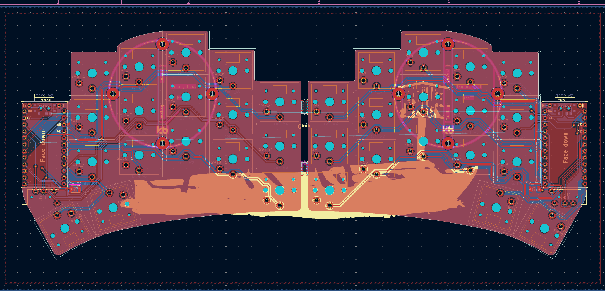
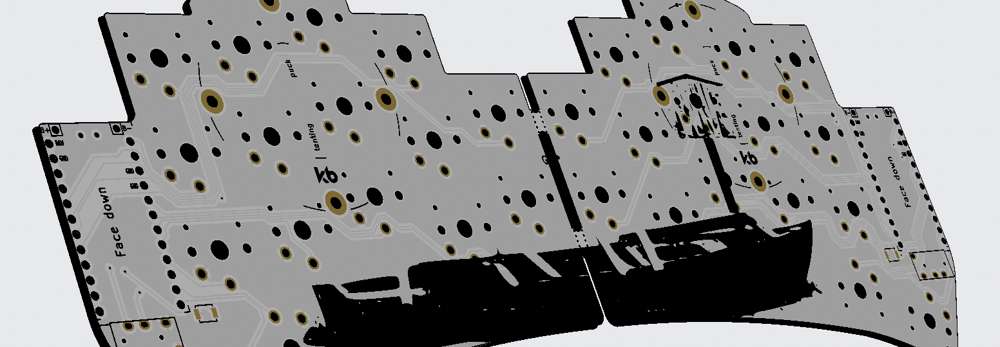

# Goals
Important to outline some goals for this project, building a custom keyboard isn't just to get chicks. There's a few things I'd like to takeaway from this project:
- Learn a little about PCB design. A lot of this is abstracted away, but it would still be nice to understand some basic things like why the traces are routed the way they are.
- Learn something about drivers and they how they enable the use of whatever board I end up picking. 
- Improve typing speed. I'm currently falling down the treacherous no mouse programming rabbit hole (it's my time), and this will hopefully help me avoid wrist strain.
- Fix my god awful soldering skills. If I'm feeling brave I might upload a benchmark picture.
- 3D printing and CAD in general (hopefully make keycaps and case from scratch).
- Do not use diodes! This is going to be a ferris build or another small build that uses direct wiring.

# Part Spec-ing
This is the parts list for my ferris sweep build, I've added links to where I sourced parts, but pricing is situational

| Part                            | Quantity       | Price (CAD)         | Description                                                              |
| ------------------------------- | -------------- | ------------------- | ------------------------------------------------------------------------ |
| PCB                             | 1 (4 Spares)   | 25.11               | Modified from the [sweep2 PCB](https://github.com/davidphilipbarr/Sweep) |
| ATMega32u4 Pro Micro            | 2 (1 Spare)    | 29.04               | From Amazon                                                              |
| 3.5mm TRRS                      | 1              | 10.99               | From Amazon                                                              |
| PJ320A TRRS Jack                | 2 (8 Spares)   | 5.35                | From [AliExpress](https://www.aliexpress.com/item/1005010770707376.html) |
| Kailh Low-Profile Choc Switches | 34 (16 Spares) | 24.90               | From [AliExpress](https://www.aliexpress.com/item/1005008883418065.html) |
| 1 USB C Cable,                  | 1              | From my desk drawer | How do you not own one of these                                          |
| 34x Keycaps                     | 34             | ~5$                 | for filament                                                             |

Total spend was just about 100$ CAD, and would've been around 85 without purchasing spare parts. If you can wait for sales on parts, you could likely get everything for <70 CAD or <50 USD
# PCB Configurations
I say "configuration" as I didn't actually design anything, this process was made incredibly simple as I just stole the PCB design from the creator who provides a working design. This has caused my PCB to actually work. I did modify the profile to create a more compact keyboard, but that is all. 

 
	
	

I'm Linking my design on my Github if anyone would like to copy my design, but you should be taking the design from the source and modifying it yourself. The creator's Github is linked in the materials list. Screwing around with KiCad was interesting, but it seems I'll need to undertake a proper circuit design project to justify forcing myself to learn PCB design.
# Keycap and Base Manufacturing
Dimensions are 16.50mm x 16.50mm x 3.70mm according to most defacto keycap manufacturers. The switch dimensions I pulled from the official site were more reliable given that I needed to worry about tolerances so much with the PLA shrinkage. 

![[kbkailhswitches.png]]

# Assembly

# So How Did I Do?
Did I meet most of the goals I laid out?
- Typing speed seems to have improved. adding layers for number and symbols does make typing for programming a lot easier. lots of improving to be made as I learn to type, but this has certainly helped.
- Fix is a strong word, but my soldering skills certainly improved. I couldn't find a photo to reference improvement, but most of the microcontroller soldering was fine. Soldering so many joints back to back helped me get into a groove. Good project to learn soldering on.
- I did in fact, not use diodes, fuck that.

What I did not learn:
- PCB Design - this is not a huge shocker as the design is already done by the creator and I did not want to risk it not working when I waited a month for shipping.
- Learn about drivers - once again, this project relies on already supported firmware and I did not need to look into drivers for any reason. I did not have the balls to build something from scratch and hope it worked with my project. Like with PCB design, I might just need to start on a smaller project done completely from scratch.
- I wouldn't say my CAD skills improved much, as I don't thunk keycaps are necessarily something impressive to make in fusion. That said, printing skills have improved slightly, I have a better idea of what to plan for when printing, especially around material shrinkage and tolerancing. Once again, it seems like a bigger, more "from scratch" project is needed to actually learn the hard stuff and this was a good warm up. I do have something planned soon for a printing project.
# Handy Resources 
- https://github.com/davidphilipbarr/Sweep
- https://youtu.be/fBPu7AyDtkM
- https://youtu.be/8wZ8FRwOzhU
- http://www.kailh.com/en/Products/Ks/CS/321.html?ref=showcase.beekeeb.com (not secure)